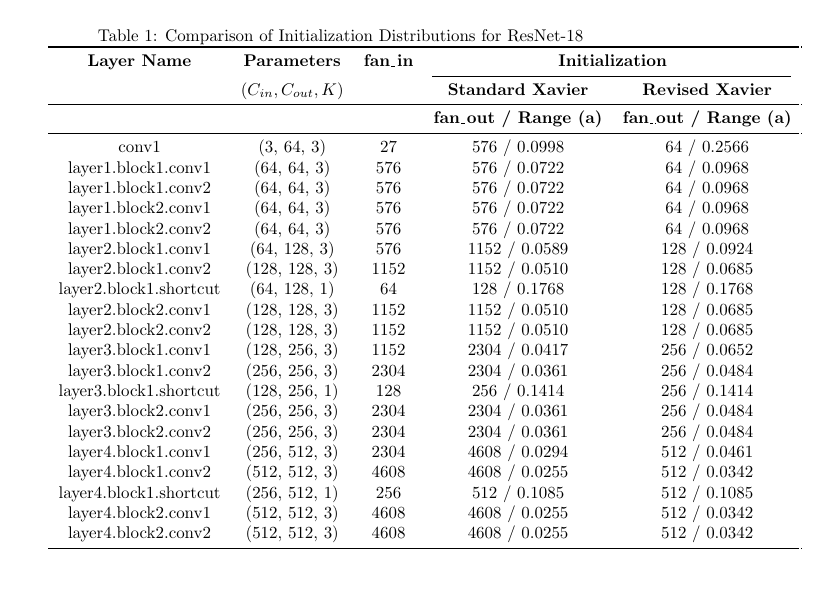
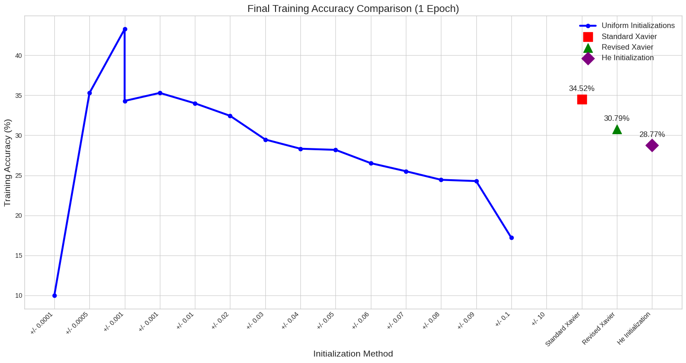
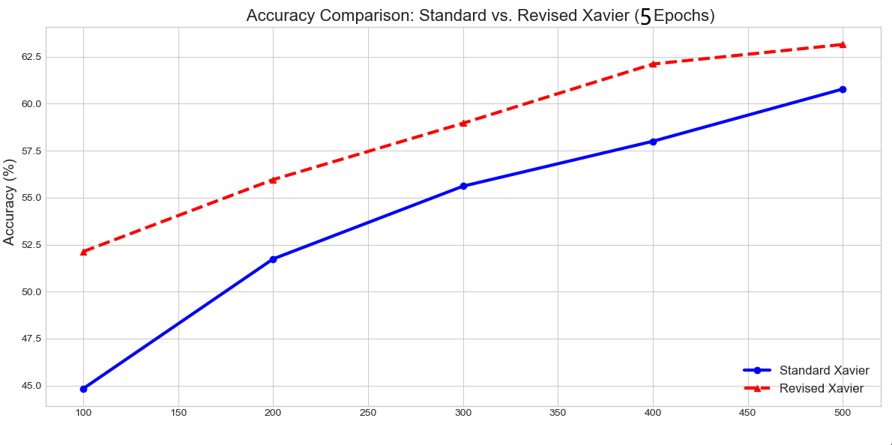

# The Incorrect Implementation of Xavier Weight Initialization for Convolutional Layers in PyTorch

# 

## 1. A Simple Review of Xavier Initialization

Xavier and He are two well-known weight initialization schemes. Their purpose is to stabilize training. Xavier is designed for symmetric activation functions like softmax and tanh, while He is for half-rectified functions like ReLU.

Let's review the derivation for a fully connected layer. We have:

- **Input:**  $x_1, x_2, \dots, x_{n_{\text{in}}}$, with a total of $n_{\text{in}}$ neurons.
- **Output:**  $y_j = \sum_{i=1}^{n_{\text{in}}} w_{ji} x_i$ (assuming bias $b=0$).
- **Weights:**  $w_{ji} \sim N(0, \sigma_w^2)$, with a mean of 0 and variance of $\sigma_w^2$.

For the forward pass, we calculate the variance of the output:

$$
\text{Var}(y) = \text{Var}\left( \sum_{i=1}^{n_{\text{in}}} w_i x_i \right)
$$

Assuming independence between weights and inputs, this simplifies to:

$$
\text{Var}(y) = \sum_{i=1}^{n_{\text{in}}} \text{Var}(w_i x_i) = n_{\text{in}} \cdot \sigma_w^2 \cdot \sigma_x^2
$$

Xavier initialization considers numerical stability for both the forward and backward passes.

### Forward Pass

We hope that the output variance is roughly equal to the input variance:

$$
\text{Var}(y) \approx \text{Var}(x)
$$

This leads to the condition:

$$
n_{\text{in}} \cdot \sigma_w^2 \cdot \sigma_x^2 \approx \sigma_x^2
$$

$$
n_{\text{in}} \cdot \sigma_w^2 = 1 \quad \Rightarrow \quad \sigma_w^2 = \frac{1}{n_{\text{in}}}
$$

### Backward Pass

For backpropagation, we need to consider the variance of the gradients. The gradient of the loss $\mathcal{L}$ with respect to the input $x_i$ is:

$$
\frac{\partial \mathcal{L}}{\partial x_i} = \sum_j w_{ji} \frac{\partial \mathcal{L}}{\partial y_j}
$$

Let the variance of $\frac{\partial \mathcal{L}}{\partial y_j}$ be $\sigma_{\delta}^2$. Then the variance of the gradient is:

$$
\text{Var}\left( \frac{\partial \mathcal{L}}{\partial x_i} \right) = n_{\text{out}} \cdot \sigma_w^2 \cdot \sigma_{\delta}^2
$$

To ensure stable gradients, we hope that the variance of the input gradients is equal to the variance of the output gradients:

$$
n_{\text{out}} \cdot \sigma_w^2 = 1 \quad \Rightarrow \quad \sigma_w^2 = \frac{1}{n_{\text{out}}}
$$

These are our two objectives. To satisfy both, Xavier takes the harmonic mean of the two variance conditions, which results in the final variance for the weights:

$$
\sigma_w^2 = \frac{2}{n_{\text{in}} + n_{\text{out}}}
$$

‍

‍

## 2. An Alleged Flaw in PyTorch's Implementation

The original Xavier paper, however, didn't specify how to handle convolutional layers, so its application became open to interpretation.

First, let's consider who $n_{in}$ should be. Convolution has its own unique properties, but like a fully connected layer, it's fundamentally a many-to-one operation, a kind of sliding matrix multiplication.

Naturally, a convolutional kernel's shape (in PyTorch's definition) is:

$$
[C_{\text{out}}, C_{\text{in}}, K, K]
$$

where $C$ is the number of channels and $K$ is the kernel size (for a square kernel).

Therefore, the number of input dimensions for a single output is:

$$
n_{\text{in}} = C_{\text{in}} \times K \times K
$$

This represents the number of dimensions in the input tensor that a single kernel operation takes in.

Now for $n_{\text{out}}$. Not just PyTorch, but frameworks like JAX, MXNet, and PaddlePaddle all handle $n_{\text{out}}$ in the same way:

$$
n_{\text{out}} = C_{\text{out}} \times K \times K
$$

This seems symmetric, right? The problem lies in this definition of $n_{\text{out}}$. Mathematically, it's incorrect and has been a long-standing misunderstanding.

The initial reasoning might have been as follows:

- Each output point receives $C_{\text{in}} \times K^2$ inputs, so its $n_{in}$ is that number.
- Each input point affects $C_{\text{out}} \times K^2$ outputs, so $n_{out}$ is calculated in the same way.

However, $n_{out}$ should not include the $K^2$ term; it should be just $C_{\text{out}}$. The output should not be tied to the kernel size.

Consider the case where the convolutional kernel does not slide during the operation. The output is a single vector of length $C_{\text{out}}$. Where does $K$ fit in?

Take an extreme case where the kernel and the feature map are the same size. The convolution completely degenerates into a fully connected layer. The output is a single vector, and $n_{out}$ should clearly be $C_{\text{out}}$, with no $K \times K$ term. Even when sliding, the variance of the group of feature maps that the kernel operates on should be the same as the overall variance. This is the "sampling" idea. This is, in effect, performing a weight-shared MLP multiple times.

This critique was not first raised by me; there have been some discussions about it online [1, 3].

Therefore, the corrected version is:

$$
n_{\text{in}} = C_{\text{in}} \times K \times K
$$

$$
n_{\text{out}} = C_{\text{out}}
$$

Below is the source code for PyTorch's `xavier_uniform_` initialization.

‍

‍

### 3. Experiments

All experiments below monitor the **training set accuracy**. We use SGD with a learning rate of 0.001, without learning rate scheduling, data augmentation, or regularization. The dataset is CIFAR-10.

The experimental charts do not include error bars, but the tests were performed multiple times.

#### 3.1 Experiment 1

I use a **ResNet-18** model on CIFAR-10, with the first convolutional layer modified to adapt to CIFAR-10's input size. The model is trained for 3 epochs.

The performance of my revised initialization was worse, and it converged more slowly than the standard version. However, this is the expected outcome.

‍

The standard version of Xavier performed better. The reason might be that a denser initialization range is required, as the assumptions of the original derivation no longer hold.

Just because one approach works better doesn't mean it's correct; in academia, the goal is a "fair comparison."

1. The previous assumptions about the input distribution are invalid due to the presence of Batch Normalization [6].
2. Batch Normalization can also, to some extent, reduce the impact of weight initialization and stabilize training [2, 7, 8].
3. Residual connections introduce uncertainty. The initial derivation did not account for these skip connections.
4. When using Batch Normalization or Layer Normalization, an empirical conclusion is that the initialization distribution for each weight should be tighter for stable training. This is why many modern Transformer-based models, in particular, are starting to use uniform distributions like $[-0.02, 0.02]$ for initialization, without considering the specific dimensionality of the network [4, 5].
5. There has been a discussion online that Xavier initialization works better than He for convolutional networks.

Since this is not a formal paper, I won't delve into why a denser distribution is necessary. The current goal is to verify the following: the standard Xavier, by including $K \times K$ in the denominator, results in a tighter overall initialization.

First, let's calculate the distribution ranges for both initialization schemes.

‍

‍

‍

Indeed, the standard version is denser.

### 3.2 Experiment 2

Since initialization primarily affects initial performance, we will look directly at the training set accuracy after the first epoch. We will again use ResNet-18.

Starting from a uniform distribution of $\pm 0.0001$ and extending up to $\pm 10$, we performed more granular subdivisions in the middle and plotted the accuracy curve (this range happens to include the calculated values from the table).

Note that the interval changes here are not equidistant; they were chosen rather arbitrarily.

‍

‍

First, let's look at the three small graphs on the right.  
Here, He initialization performs the worst among the three schemes. Because He omits the $n_{out}$ term, its distribution is wider. Even though ResNet uses ReLU, the assumption seems to fail in this case.  
Second, when I used a uniform distribution of $\pm 0.001$, the effect was surprisingly better than that of the standard version.

**Conclusions:**

1. The standard Xavier, by using $C_{out} \times K \times K$ in the denominator, performs better because the initialization range is denser, not because it is fundamentally correct.
2. I suspect that even with a $K^3$ term, there's a chance it might perform better, as it would likely land on this optimal peak.
3. Once the kernel size becomes large, I hypothesize that this advantage will disappear. The denominator would become excessively large, causing the initialization range to slide to the left side of the curve.

---

### 3.3 Experiments with a Large Kernel and tanh on CIFAR-10

To further prove that the original version is incorrect, I created a small convolutional network without Batch Normalization or residual connections. The remaining configurations were the same as before. The network was trained for 5 epochs.

‍

‍

‍

‍

At this point, my revised version performed better, and the difference was significant.  
This strongly indicates the existence of an issue.

Thank you for reading. Academic work demands rigor, and flawed implementations should be called out. I wish everyone great success in their academic pursuits!

‍

‍

## 

## References

[1][https://stats.stackexchange.com/questions/198840/cnn-xavier-weight-initialization](https://stats.stackexchange.com/questions/198840/cnn-xavier-weight-initialization)

[2][Deconstructing the Goldilocks Zone of Neural Network Initialization](https://arxiv.org/abs/2402.03579)

[3][https://stackoverflow.com/questions/48137312/is-weight-initialization-different-for-dense-and-convolutional-layers](https://stackoverflow.com/questions/48137312/is-weight-initialization-different-for-dense-and-convolutional-layers)

[4][https://cdn.openai.com/research-covers/language-unsupervised/language_understanding_paper.pdf](https://cdn.openai.com/research-covers/language-unsupervised/language_understanding_paper.pdf)

[5][https://aclanthology.org/D19-1083.pdf](https://aclanthology.org/D19-1083.pdf)

[6][Batch Normalization: Accelerating Deep Network Training by Reducing Internal Covariate Shift](https://arxiv.org/abs/1502.03167)

[7][https://arxiv.org/pdf/1702.08591](https://arxiv.org/pdf/1702.08591)

[8][https://arxiv.org/pdf/1712.08969](https://arxiv.org/pdf/1712.08969)

‍

‍

‍
